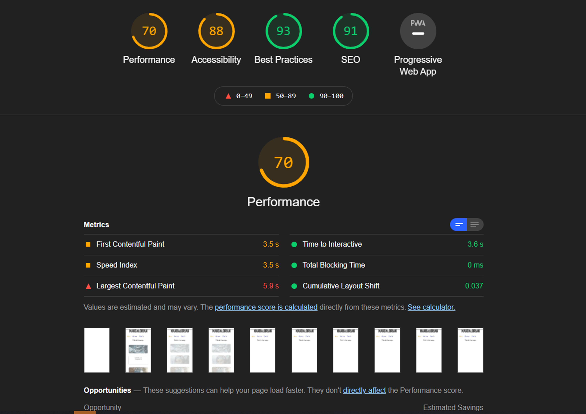

# **The Mandalorian** 

## User-Centric Frontend Development Milestone Project - Idea 1

#### Website is aboute The Mandalorian series done by *Jon Favreau*, used in a way that fits the Project Example Idea 1, as a on of three options that we have in Milestone Project 1. 

*This project is for educational purposes and can not be used as a template for a business use.*
*Main goal was to build responsive website with HTML and CSS only. Use of Bootstrap framework was optional and i will not use it this time.*

---

#### The Mandalorian series done by *Jon Favreau*, used in a way that fits the Project Example Idea 1, as a on of three options that we have in Milestone Project 1. 

### _**We all know how strong force can be, why not explore it a bit deeper on a pure html css website!**_
     Join us on The Mandalorian journey...

###  **[Site is published at github pages](https://danthestar.github.io/the-mandalorian/)**     
---
---
## **Content Tree**
---
---

- [UX](#ux)
    - [Owner goals](#owner-goals)
    - [User goals](#user-goals)
      1. [New goals](#new-goals)
      2. [Returning user goals](#returning-user-goals)
    - [User side](#user-side)
      1. [Green customer](#green-customer)
      2. [Veteran customer](veteran-customer)
    - [Structure of the website](#structure-of-the-website)
    - [Wireframes](#wireframes)
    - [Surface](#surface)
- [Features](#features)
  - [All pages](#all-pages)
  - [Features Left to Implement](#features-left-to-implement)
- [Technologies Used](#technologies-used)
- [Testing](#testing)
    - [Functionality testing](#functionality-testing)
    - [Compatibility testing](#compatibility-testing)
    - [Performance testing](#performance-testing)
- [Deployment](#deployment)
- [Credits](#credits)
- [Screenshots](#screenshots)
---
---
## UX
---
---
## Owner goals
#### Goal was to build simple but effective website with features similar the mandalorian series so it will embodies the genre of the series.
#### This way; by simple eye catching and intuitive/interactive form which is already well known as beginner friendly, that allows us to get closer to the rest of the audience, even to those who never heard of Mandalore before.
#### It also a "place" that contains/provides all information regarding Mandalore series: form stores, galleries, history, news, where to watch, soundtrack, etc.

## User goals
---
### 1.New goals
   * Where to Watch
   * Where to Buy
   * Where to Follow
   * Knowing about history and ideas forme screenwriters
   * How is made
   * Check the All news regarding the Mandalorian series

### 2.Returning user goals:
- user's can always finde whats new in Mandalore world
- user's can prety mutch do the same staff listed above in *[New goals](#new-goals)*

## User side
---

### As a Industrial Designer
* FFA = form must follow function in every aspect of creation!
* Saying that evrything on my site it has a purpose, a goal and a task., followed by ffa rule.
* And all that for simple goal: to allow customer for simple eye catching fun and thrilling surf on Mandalore page.
* Keeping visual integrity simple but in same time effective eye catching product that will leave a smile on every customer that visits Mandalore page.
* Ensuring their imminent return
* Less is more

### Green customer:
---
* Interested in; what new technologies did they use on set?
* Interested in; where can i buy Mandalorian helmet,and for what price?
* Interested in; artwork of Mandalorian.
* Interested in; soundtrack of Mandalorian.
* Interested in; who are all people who are working on Mandalore set.
* Interested in; any one famous?!
* Interested in; searching for inspiration for current project.

### Veteran customer:
---
* It can be all of above, and more.

[Back to Content Tree](#content-tree)

## **Structure of the website**
---
FFA, so all  media query are covered and the simplistic styling is detained on all platforms: desktop, tablet or mobile device.
Simple but effective.

##### First brakpoint at: @media screen and (max-width: 1016px) = quick pick section of 5 consecutive options, they are first one witch brakes structural visual integrity of a site!
   * Since my goal was to keep structural integrity of visual identity through all screen sizes
##### Second brakepoint and last one for my form was on (max-width: 552px) when my right side of menus are colliding with left side causing unpleasant visual disturbance.
   * And since that width it so close to phone size from that point on, I decided to translates it all smartphone sizes, since it only small gap of width: 100px max

Beginner friendly, intuitive with moderate tones that do not strain the pupils further after a long stay.

Interaction interface so all buttons and links have one or two interactive effects.

## **Wireframes**
---
Idea was to used website wireframe.cc to create a wireframes...if i got in time!

## **Surface**
---

### Colors
Main colours:
* background color: none
* font color base: #555555, rgb(255, 255, 255)
* link color base hover: rgb(255, 145, 0, 1)
* link color base: #555555
* link color base hover:rgb(255, 145, 0, 1)
* hoover color in general: rgb(255, 145, 0, 1)

### Fonts 

   1. Lato = [Google Fonts Library](https://fonts.google.com/) as general
   2. Montserrat = [Google Fonts Library](https://fonts.google.com/)
   3. Mandalore = [Picture and Magic](https://www.picturethemagic.com/?s=mandalore) as maine title 
   4. WaltDisney = [Picture and Magic](https://www.picturethemagic.com/free-disney-fonts/) situational
   * sans-serif as a backup!
### Images

* Images from Google will be all credite in [credits](#credits) section.

### Video

* 
* Video in background = [The Mandalorian | Season 2 Official Trailer](https://www.youtube.com/watch?v=eW7Twd85m2g&t=12s)

[Back to Content Tree](#content-tree)

---
---
## Features
---
---

### The website contains six pages. Three are accessible from a navigation menu.

### **Navigation bar** 
### **Footer**

*  Navigation bar and footer dock are visible on each website. 
* It is responsive and will slide under maine titile on mobile devices.

    * On left side is maine title as logo and home link.
    * On right side there are three links:
        1. Home
        2. Gallery
        3. Sign In
    * On bottom we have fotter who provide 5 links:
        1. [Facebook link](https://www.facebook.com/themandaloriannet/)
        2. [Twitter link](https://twitter.com/themandalorian?ref_src=twsrc%5Egoogle%7Ctwcamp%5Eserp%7Ctwgr%5Eauthor)
        3. [Official page](https://www.starwars.com/series/the-mandalorian)
        4. [Artwork link](https://disneyartonmain.com/collections/mandalorian-artwork)
        5. [Instagram link](https://www.instagram.com/themandalorian/)
        * Each link will open in a new separate tab in a browser.

### **All pages**
---

1. **Maine page**
   * As a user type, I want to achieve eye catching maine page that will set the first impression on customer
   * Three "popup" providers on maine page: info/history, sell/promote, how it made
     * Quick chek by picking one of three popup's that leads to a separate page only by itself providing all adiditonal info as easy dive into topics.
   * Middle-bottom section consist 5 href's that lead on new page that are important to series
   * Header and footer provide standard  links options as home, gallery, sign in, and diferent social media platforms
2. **Gallery page**
   * Making the bond
     * Images that provide a wide range of diversity covered by the series that which depicts scenes similar to those from everyday life making it easier to immerse into world of Mandalore and becoming part of it
3. **Sign up**
    * Everyday Sing in followed by similar style and colors to stay consistent, with adorable baby yoda who adds another layer of pressure on you becoming next new member
4. **PopUp** 
    * links in form of a three image, that are represents on new separate page:
       1. **Info** - information and history about Mandalorian sereies
       2. **Sell** - dection wher users can buy everything related to the Mando brand
           * Disney official trading site of [Mandalorian Artwork](https://disneyartonmain.com/collections/mandalorian-artwork)
           * And many others...
       3. **How it made** - part where are link's with technology that producers are using in filming the majority of mandalore scenes  
           * but because of lack of time on project i will leave just blank page
5. **Middle bottom section another row of 5 href's that are more specified options:**
    1. **[Disney]((https://www.disneyplus.com/en-ie/welcome/the-mandalorian?cid=DSS-Search-Google-71700000064567604-&s_kwcid=AL!8468!3!472720924508!e!!g!!mandalorian&&cid=DSS-Search-Google-71700000064567604-&s_kwcid=AL!8468!3!472720924508!e!!g!!mandalorian&gclid=Cj0KCQiAoab_BRCxARIsANMx4S41MNTbtCbFodqLqq4EAnovAYlL-rCR4U3Uz4WfgSJfOGiAJ8TM-tMaAmgeEALw_wcB&gclsrc=aw.ds))** = official Disney chanel which includes Mandalore as well
    2. **[IMDB]((https://www.imdb.com/title/tt8111088/))** = page as useful links to all general information about series in general for the seventh art
       * who is the director, which year recorded, full cast crew list, box office, and many more 
    3. **[Emmys]((https://www.emmys.com/shows/mandalorian))** = television academy link with Awards & Nominations related to Mandalorian series
    4. **[Soundtrack]((https://open.spotify.com/playlist/5SvVBFpeieH6tH6Sg0uVOR))** Spotify link to all The Mandalorian Original Series Soundtrack 
    5. **[Season 3]((https://screenrant.com/mandalorian-season-3-future-story-no-baby-yoda/))** = everything related to new season release of Mandalorian series

[Back to Content Tree](#content-tree)

### *Features Left to Implement*
---
* **I was trying so hard to push my main idea into realization** by having short delay of icons(main title/home,gallery,sign in buttons, etc) that will follow the beats from video in background on loope, and be able to pefomr hover effect after the delay effect is done, plus having a options thet will indicate by different color the page you are currently on
    * due to I wasted entire week trying to make that one part to work by trying from all different angels and not have success, it forces me to take simpler approach 
    
* among other staff, goal was to make all pages not just blank page "work in progres..", but i don't have enough time to create them all
* idea again was simple:
  1. for How it Made.html goal was to make playable video intro of latest footag of mp4. format and it will take 70-80% of width and 40-60% max of hight as main attraction-so to say
     * under that will go all less intrested links and stories on evrything how did developers on set decided to film this series
  2. Info and Sell department, for them i was having something simple in mind = like simple list of hrfef's that leads to stores/history pages   
* and there is another issue or small mistake that i will not have time to settle, and that is in "Gallery" page: on hover all img that are near to borders are being cut off after animated part is done? I'm not sure what is causing that effect!

[Back to Content Tree](#content-tree)

---
---
## **Technologies Used**
---
---

### **Core structure**
* HTML5

### **Style language**
* CSS

### **Icons**
* [Font Awesome](https://fontawesome.com/icons?d=gallery&m=free)

### **Fonts**
* [Google Fonts Library](https://fonts.google.com/)
* [Google Fonts Library](https://fonts.google.com/)
* [Picture and Magic](https://www.picturethemagic.com/?s=mandalore)
* [Picture and Magic](https://www.picturethemagic.com/free-disney-fonts/)

### **Storage**
* GitHub

### **Coding platform**
* Gitpod

### Wireframe.cc
* As a wireframing tool.

### **Image editor**
* Photoshop

### **Video editor**
* LosslessCut

### **Testing Performance editor**
* [Lighthouse exstention](https://developers.google.com/web/tools/lighthouse) 

### **Visual editor**
* [Am I Responsive](http://ami.responsivedesign.is/) 

[Back to Content Tree](#content-tree)

---
---
## **Testing**
---
---

### **Functionality testing** 

  * Most of the time i was doing this topic, testing, testing and a bit more testing the code and checking on inspect how will my code change trough css.
  * Im using Microsoft Edge/Chrome

### **Compatibility testing**
 Site was tested across multiple virtual mobile devices and browsers. I have checked all device emulations in Chrome developer tools. 
 
 I tested on Msi laptops, Msi workstation, Custom made desktop, Galaxy s10e android 11, Redmi, Redmi Xiaomi, Redmi Note 8.

 ## Performance testing
---
I use [Lighthouse](https://developers.google.com/web/tools/lighthouse/) tool to check performance of the website.
I had to do couple of changes to improve performance. Screenshots are presented below:

---

---
---

---
---

* although I did not have enough time to correct all the mitigating circumstances I received through the lighthouse report!

[Back to Content Tree](#content-tree)

---
---
## **Deployment**
---
---
The project was deployed on GitHub Pages. I used Gitpod as a development environment where I commited all changes to github. I used push command in Gitpod to save changes into GitHub.

* ###   Your site is published at https://danthestar.github.io/the-mandalorian/
---
---
## **Credits**
---
---

### **Idea**
* The idea of going with the Mandalorian series it purly becouze i love that series my self and that the area that im way more familiar than Musical bends or Gym, and third option: personal portfolio site (potentially for myrself) im keeping that one as last project.
* [YouTube the Mandalorian](https://www.youtube.com/watch?v=eW7Twd85m2g&t=12s) link for trailer as the source of my inspiration; since the original series i watch over the stream (and there is no point of linking that)
* not to mention that it’s close to my passion regarding art as Industrial designer, form which I also find ideas in SW triology
### **Content**
* The base for main structure in similar to structuro of [Love Running](https://courses.codeinstitute.net/courses/course-v1:CodeInstitute+CF101+2017_T1/courseware/1f0ccaac7a3e43d895c1beae5363f46c/8b3e9adaef764e1d962a85668c799cdd/?activate_block_id=block-v1%3ACodeInstitute%2BCF101%2B2017_T1%2Btype%40sequential%2Bblock%408b3e9adaef764e1d962a85668c799cdd) from where i take mouste of structural frames
* Readme file inspirations are:
  1. [NielMc](https://github.com/Code-Institute-Solutions/readme-template) on GitHub
  2. [marcin-kli](https://github.com/marcin-kli/MP1/blob/Milestone-Projects/README.md)
### **Media**
* **img files** are seperated in 2 sections:
    * Processed:
       
       
       
       
       
       
       

    * and raw:   
      1. [img](https://static1.cbrimages.com/wordpress/wp-content/uploads/2020/12/the-mandalorian-header.jpg?q=50&fit=crop&w=960&h=500)
      2. [img](https://media4.s-nbcnews.com/j/newscms/2019_51/3152506/191217-baby-yoda-mandalorian-the-child-3-ew-603p_7274a4e9bf43436d994c191251380f00.fit-760w.jpg)
      3. [img](https://www.fanthatracks.com/wp-content/uploads/2020/02/themandalorian_gideon_3.jpg)
      4. [img](https://cdn.mos.cms.futurecdn.net/DGuVUJmMkyB4yq27QyJF2U.jpg)
      5. [img](https://www.slashfilm.com/wp/wp-content/images/The-Mandalorian-The-Passenger-Review.png)
      6. [img](https://www.small-screen.co.uk/wp-content/uploads/2019/12/the-mandalorian-epoisode-4-still-1.jpg)
      7. [img](https://ftw.usatoday.com/wp-content/uploads/sites/90/2019/11/mando_1115-1_8cf9df5a-e1573842891701.jpeg?w=1000&h=600&crop=1)
      8. [img](https://img1.looper.com/img/gallery/what-the-mandalorian-reveals-about-yoda/intro-1604961040.jpg)
      9. [img](https://www.thecinemaspot.com/wp-content/uploads/2019/11/mando-1-800x445.jpg)
      10. [img](https://primaryignition.files.wordpress.com/2020/11/the-mandalorian-season-2-episode-1-image-2.jpg)
      11. [img](https://i.redd.it/xm3n6j9rnd651.jpg)
      12. [img](https://pbs.twimg.com/media/Elle5BwXUAAsM38.jpg)
      13. [img](https://www.cinelinx.com/wp-content/uploads/2020/05/rsz_screenshot_2020-05-01_at_95506_am.jpg)
      14. [img](https://fastly.syfy.com/sites/syfy/files/styles/1400xauto/public/bo-katan-in-the-mandalorian.jpg)
      15. [img](https://static3.srcdn.com/wordpress/wp-content/uploads/2020/11/Ahsoka-Tano-and-Din-Djarin-in-The-Mandalorian-Season-2.jpg)
      16. [img](https://miro.medium.com/max/3000/1*78Y5zP5aSoFcg7DJO7FE6A.jpeg)
      17. [img](https://d3dh6of9cnaq4t.cloudfront.net/Pictures/1024x536/6/0/4/11604_huc058679.pip_106699.jpg)
      18. [img](https://manchestermag.com/wp-content/uploads/2020/12/Fennec-Shand-and-Boba-Fett-in-The-Mandalorian-Season-2-Episode-6.jpg)
      19. [img](https://media.comicbook.com/2020/10/the-mandalorian-season-2-premiere-tuskin-raiders-banthas-1242956-1280x0.jpeg)
      20. [img](https://static3.srcdn.com/wordpress/wp-content/uploads/2020/11/Mandalorian-02x05-Ahsoka-and-Din.jpg?q=50&fit=crop&w=740&h=370)
      21. [img](https://s3-us-west-2.amazonaws.com/flx-editorial-wordpress/wp-content/uploads/2020/10/30112138/mandalorian-s2-ep1-the-child-baby-yoda-600x314.jpg)
      22. [img](https://www.denofgeek.com/wp-content/uploads/2020/11/the-mandalorian-bo-katak-kryze-how-old-age.jpg?resize=768%2C432)
      23. [img](https://i.redd.it/yr68sl17nn441.jpg)
      24. [img](https://media1.popsugar-assets.com/files/thumbor/JSPp1Ik_nL-3vq_tITfYcwPLCfI/fit-in/728xorig/filters:format_auto-!!-:strip_icc-!!-/2020/11/02/722/n/44498184/adf43ec65fa031ba9dba89.11740971_/i/mandalorian-season-2-premiere-cast.jpg)
      25. [img](https://i2.wp.com/www.tor.com/wp-content/uploads/2019/11/mandalorian-ch4-9.png?fit=800%2C+9999&crop=0%2C0%2C100%2C336px&ssl=1)
      26. [img](https://dorksideoftheforce.com/files/2020/11/chapter-11-the-mandalorian-bo-katan-5jt08yt974.jpg)
      27. [img](https://multiversitystatic.s3.amazonaws.com/uploads/2019/12/Mandalorian-Chapter-6.jpg)
      28. [img](https://emptylighthouse-production.s3-us-west-2.amazonaws.com/s3fs-public/field/image/mando.jpg)

* **mp4 files** this is the original link of [Mandalorian](https://www.youtube.com/watch?v=eW7Twd85m2g&t=12s) intro that i have used
   * the one that i'm using its recrop by myself = root folder source
* **all others links that i have used:**
   * [soundtrack](https://open.spotify.com/playlist/5SvVBFpeieH6tH6Sg0uVOR) link provided by Spotifey
   * [official page](https://www.disneyplus.com/en-ie/welcome/the-mandalorian?cid=DSS-Search-Google-71700000064567604-&s_kwcid=AL!8468!3!472720924514!e!!g!!mandalorian&&cid=DSS-Search-Google-71700000064567604-&s_kwcid=AL!8468!3!472720924514!e!!g!!mandalorian&gclid=Cj0KCQiAoab_BRCxARIsANMx4S4BtuvNKgT6OGFxj-TIf4nxNNDyM5vIBschzdfRKsghJznKWbXAI-kaAoTLEALw_wcB&gclsrc=aw.ds) link provided by Disney+
   * [IMDB](https://www.imdb.com/title/tt8111088/) link provided by IMDB
   * [Emmys](https://www.emmys.com/shows/mandalorian) link used form Televison Academy
   * [season 3](https://screenrant.com/mandalorian-season-3-future-story-no-baby-yoda/) link provided by ScreanRant
  
* **Icons** used fom [Font Awesom](https://fontawesome.com/icons?d=gallery&m=free)
* **Fonts** 
    * **Lato:** from [Google Fonts Library](https://fonts.google.com/)
    * **mandalore:** from [Picture and Magic](https://www.picturethemagic.com/?s=mandalore)
    * **waltDisney:** from [Picture and Magic](https://www.picturethemagic.com/free-disney-fonts/)

### **Acknowledgements**
---
* **Special Thanks to:**
    * my Mentor - **Adegbenga Adeye**.
    * all the **Tutor Assistance** (even tho i didn't use them as mutch)
    * **HUGE** thanks to all girls and guys in the **[Slack Community](https://slack.com/intl/en-ie/)** for providing constant and quite fast response time for every my query!!
        * no matter how stupid that query my be
    * **Student Care** for constant care and providers of usuefull additional information out side of follow lectures
    * Troubleshooting Tips - it a handy
    * and everyone else who supports me on this Coding journey
--- 
[Back to Content Tree](#content-tree)
### *Daniel Matasic*
